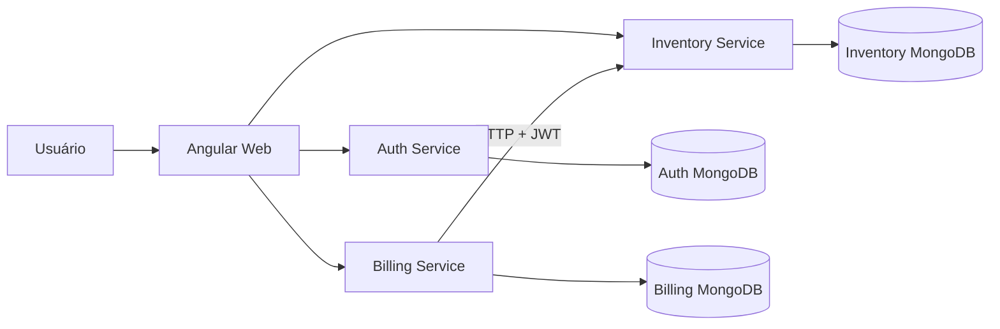
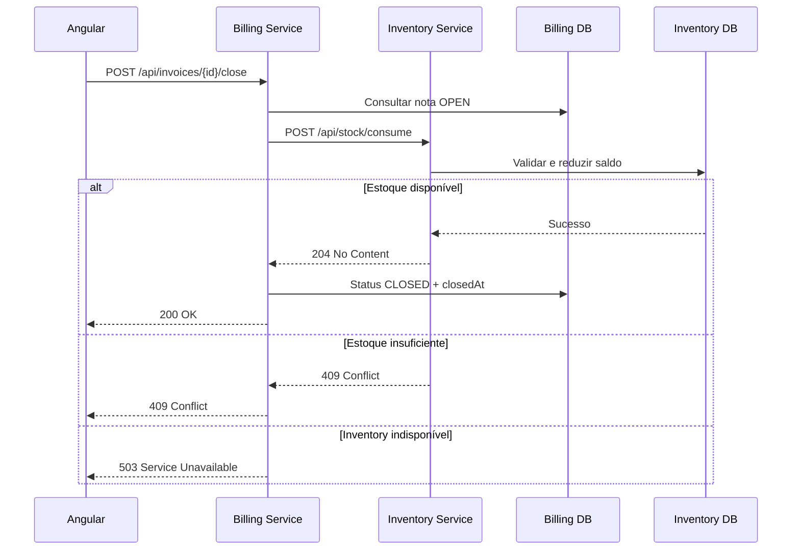

# Arquitetura — Nexa Fiscal

## Visão geral

O Nexa Fiscal utiliza um frontend Angular e três microsserviços independentes em ASP.NET Core.

## Responsabilidades

### Angular Web

Responsável pela interface, formulários, navegação, estado visual e comunicação HTTP. Regras críticas como alteração de saldo e fechamento de notas permanecem no backend.

### Auth Service

Gerencia usuários e autenticação. Emite JWTs utilizados pelo frontend e validados pelas APIs de Inventory e Billing.

### Inventory Service

É a autoridade sobre produtos e estoque. Mantém o saldo persistido e executa a baixa utilizando atualização condicional, evitando que uma operação consuma uma quantidade maior que a disponível.

### Billing Service

É a autoridade sobre notas fiscais. Mantém numeração, itens, status e coordena o fechamento junto ao Inventory Service.

## Fluxo de fechamento

A nota somente é marcada como `CLOSED` após a confirmação da baixa pelo Inventory Service.

## Dados e isolamento

Cada serviço possui seu próprio banco lógico e não acessa diretamente os dados de outro microsserviço:

- `NexaFiscalAuth`;
- `NexaFiscalInventory`;
- `NexaFiscalBilling`.

No ambiente local, cada banco também utiliza um container e volume próprios no Docker Compose.

## Autenticação

1. o usuário realiza login no Auth Service;
2. o serviço emite um JWT assinado;
3. o Angular envia o token no header `Authorization`;
4. Inventory e Billing validam issuer, audience, assinatura e expiração;
5. ao chamar Inventory, Billing encaminha o token recebido.

## Tratamento de falhas

O sistema diferencia falhas técnicas de conflitos de negócio:

- estoque insuficiente retorna `409 Conflict` com os itens afetados;
- Inventory indisponível é traduzido pelo Billing para `503 Service Unavailable`;
- falhas de persistência conhecidas são tratadas sem expor stack trace ao frontend;
- o Angular apresenta mensagens compreensíveis e mantém a nota aberta quando o fechamento não é confirmado.

## Decisões atuais

- comunicação entre Billing e Inventory: HTTP síncrono;
- persistência: MongoDB com `MongoDB.Driver`;
- autenticação: JWT Bearer;
- saldo: atualização condicional atômica por produto;
- compensação local é utilizada caso uma baixa com múltiplos itens falhe parcialmente durante o processamento.

Idempotência, retry e circuit breaker não fazem parte da implementação atual. Esses mecanismos podem ser adicionados como evolução para aumentar a resiliência em cenários de resposta perdida ou falhas transitórias.
